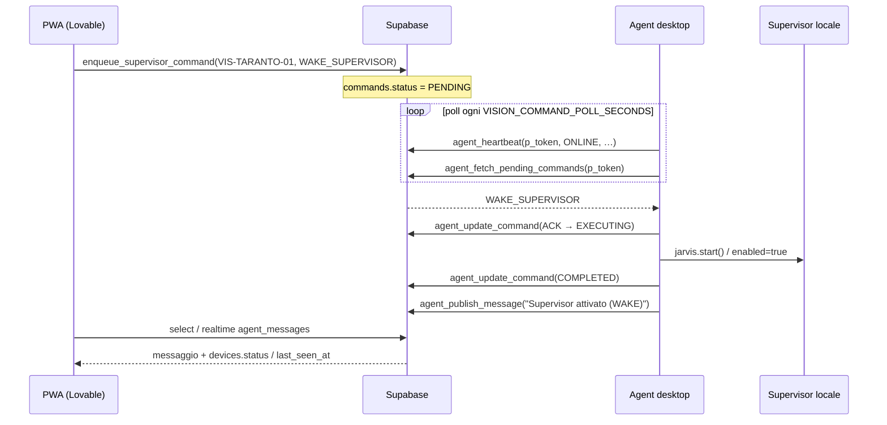
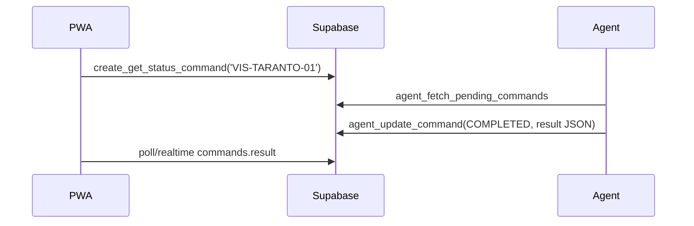

# Agent ↔ PWA — canale sottile (Supabase)

Comunicazione **solo via Supabase** (progetto Lovable).  
Niente merge tra branch `vision-main` (Agent) e `main` (PWA).

Device logico: `VIS-TARANTO-01` (`devices.device_id` / `code`).

## Ruoli

| Lato | Repo / branch | Cosa fa |
|------|---------------|---------|
| **Agent** | `vis-ion` → `vision-main` | Heartbeat, fetch comandi, esegue WAKE/DEACTIVATE/GET_STATUS, pubblica messaggi |
| **PWA** | Lovable / `main` | Enqueue comandi, mostra stato device, legge `agent_messages` |
| **Control Panel UI** | stesso processo Agent | Console locale + stesso canale messaggi/stato |

Kill switch Agent: `VISION_REMOTE_ENABLED=true` (es. via Impostazioni o `.env` prima di `AVVIA_VISION.bat`).

## Sequenza — Sveglia Supervisor

## Sequenza — Disattiva

Stesso flusso con `DEACTIVATE_SUPERVISOR` → `jarvis.stop()` → messaggio «Supervisor disattivato».

## Sequenza — GET_STATUS (probe)

Equivalente thin: `enqueue_supervisor_command(..., 'GET_STATUS')`.

## Contratto RPC (minimo)

| Chi | RPC | Note |
|-----|-----|------|
| Agent | `agent_heartbeat` | Arg token live: **`p_token`** |
| Agent | `agent_fetch_pending_commands` | Solo thin types |
| Agent | `agent_update_command` | ACK / result |
| Agent | `agent_publish_message` | Feed PWA (`p_token`) |
| PWA auth | `enqueue_supervisor_command(device_id, type)` | WAKE / DEACTIVATE / GET_STATUS |
| PWA auth | `create_get_status_command(device_id)` | Compat esistente |

Auth Agent: `SUPABASE_ANON_KEY` + raw `VISION_AGENT_TOKEN` (hash in `agent_api_tokens`). **No** `service_role` nel desktop.

## Tabelle osservate dalla PWA

- `devices` — `status`, `last_seen_at` (presence)
- `heartbeats` — storico leggero
- `commands` — coda + result
- `agent_messages` — feed inbound (RLS select authenticated)

## Verifica end-to-end

1. `.env` Agent: `VISION_REMOTE_ENABLED=true`, `VISION_REMOTE_MODE=supabase`, token/URL valorizzati.
2. Avvia Control Panel (`AVVIA_VISION.bat`) → Impostazioni → **Testa connessione Agent**.
3. PWA: login → dispositivo `VIS-TARANTO-01` ONLINE (heartbeat recente).
4. PWA: **Sveglia** → entro pochi secondi Supervisor attivo in locale + riga in messaggi Agent.
5. PWA: **Disattiva** → Supervisor off + messaggio.
6. Opzionale: **Aggiorna stato** (GET_STATUS) → `commands.result` popolato.
